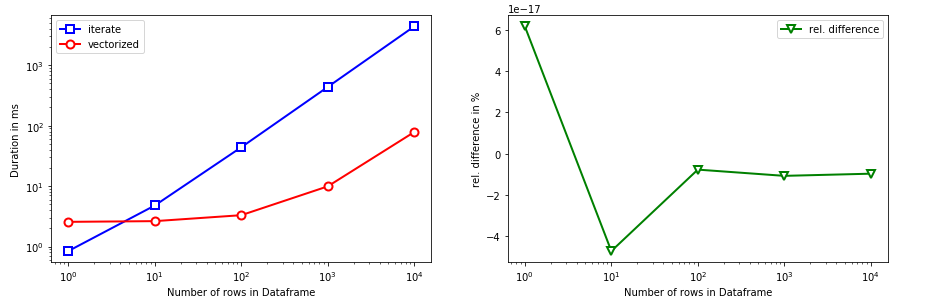
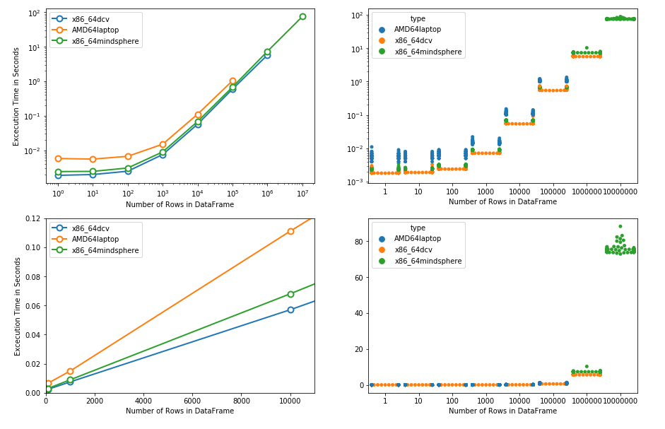

# vectorized_speed_test

Trying out two ways to apply a more complicated function to dataframe with a large number of rows.
Connected to:
1. https://stackoverflow.com/questions/55360738/how-to-efficiently-interpolate-data-in-a-pandas-dataframe-row-wise/55394360
2. https://gist.github.com/che0815/a06de781b4c3c17228f61b190b9e469f

## Comparison of iteration vs. vectorization

## Comparison of vectorization on different engines

